# ShellRelay Runner

Lightweight Go binary that connects any machine to [ShellRelay](https://www.shellrelay.com) for browser-based terminal access. No VPN, no SSH keys, no port forwarding.

## Why ShellRelay?

ShellRelay was built to solve a personal gap. AI coding tools — [Claude Code](https://docs.anthropic.com/en/docs/claude-code), [Codex CLI](https://github.com/openai/codex), [Gemini CLI](https://github.com/google-deepmind/gemini-cli), [OpenCode](https://opencode.ai) — run entirely in the terminal. The goal was simple: use those tools on a local Mac and in VPS Docker containers from anywhere — a phone, a tablet, any browser — without VPN, without SSH key management, and without port forwarding. Nothing in the market covered all of that. So ShellRelay was built from scratch.

## The Problem

Getting terminal access to a remote machine is harder than it should be.

The traditional approach — SSH — requires open ports, firewall rules, and distributed key management. On machines behind NAT, corporate firewalls, or cloud security groups that restrict inbound traffic, SSH often isn't an option at all. For Docker containers, you need access to the host first. For team environments, sharing SSH credentials is a security risk.

The result: engineers spend time fighting infrastructure just to reach a machine.

## The Solution

ShellRelay flips the connection model. Instead of you connecting *in* to the machine, the machine connects *out* to the relay. Your browser then connects to the relay — and the relay bridges the two.

- No inbound ports required
- No SSH keys to generate or distribute
- No VPN to configure
- Works through any firewall, NAT, or cloud security group
- Access any machine, Docker container, or Kubernetes Pod from any browser, anywhere

The runner is a single static binary. Install it, register the server once, and it is accessible from [shellrelay.com](https://www.shellrelay.com) immediately.

**Security:** ShellRelay acts as a relay only. Terminal data is encrypted in transit (TLS) and never stored on ShellRelay servers. Session recordings are saved exclusively on your local machine. Each server authenticates with a unique token (`sr_*`) that you control and can rotate at any time.

## 30-Second Demo



## Install

```bash
curl -fsSL https://raw.githubusercontent.com/ShellRelay/runner/main/install.sh | bash
```

Or download a binary from [Releases](https://github.com/ShellRelay/runner/releases).

Supported platforms: **macOS** (arm64, amd64) · **Linux** (arm64, amd64)

## Quick Start

### Option A — Command line (recommended)

1. Register your server — generates a claim token, saves credentials, and starts the daemon:

```bash
shellrelay announce --email you@gmail.com <server-id>
```

2. Log in to [shellrelay.com](https://www.shellrelay.com) and claim the server using the token printed above.

That's it. The daemon is already running and ready to accept connections.

### Option B — Register from the UI, then run

1. Log in to [shellrelay.com](https://www.shellrelay.com) and register a new server from the dashboard.
2. Copy the connect command shown — it looks like:

```bash
shellrelay start <server-id> <token>
```

3. Run it on your machine. Credentials are saved and the daemon starts immediately.

### Option C — Interactive menu

Just run the binary with no arguments:

```bash
shellrelay
```

An interactive menu launches. Use arrow keys or number keys to navigate.

## Interactive Menu

Running `shellrelay` (or `shellrelay menu`) launches a full interactive menu:

```
╔══════════════════════════════════════════════════╗
│                    ShellRelay                    │
╠══════════════════════════════════════════════════╣
│       1. Register server with Gmail account      │
│       2. Start daemon                            │
│       3. Stop daemon                             │
│       4. Restart daemon                          │
│       5. Status                                  │
│       6. Logs                                    │
│       7. Sessions                                │
│       8. Rotate token                            │
│       9. Set relay URL                           │
│      10. Upgrade to latest release               │
│      11. Daemon install                          │
│      12. Daemon uninstall                        │
│      13. Version                                 │
╠══════════════════════════════════════════════════╣
│       0. Exit                                    │
╚══════════════════════════════════════════════════╝

  ↑↓ to move   Enter to select   q to quit
```

- Arrow keys or number keys (1–9) to select
- Enter to confirm
- `q` or `0` to exit

## Docker

Bake the runner into any Docker image for instant browser terminal access:

```dockerfile
FROM ubuntu:24.04
# ... your app setup ...
COPY --from=ghcr.io/shellrelay/runner /usr/local/bin/shellrelay /usr/local/bin/shellrelay
COPY --from=ghcr.io/shellrelay/runner /usr/local/bin/entrypoint.sh /usr/local/bin/entrypoint.sh
ENTRYPOINT ["entrypoint.sh"]
```

```bash
docker run -e SHELLRELAY_EMAIL=you@gmail.com \
           -e SHELLRELAY_SERVER_ID=my-container \
           myimage
```

The container self-registers on startup. Check `docker logs` for the claim token, then claim it in the dashboard.

## Commands

```
shellrelay               Launch interactive menu (default when no args)
shellrelay menu          Launch interactive menu explicitly

shellrelay start         Start as a background daemon
shellrelay stop          Stop the daemon
shellrelay restart       Restart the daemon
shellrelay status        Check if the daemon is running
shellrelay logs          Tail daemon logs (-f to follow, -n <lines>)
shellrelay run           Run in foreground (no daemon)

shellrelay announce      Self-register with the relay (generates claim token)
shellrelay rotate        Rotate the server token and restart
shellrelay relay         Set a custom relay server URL and restart
shellrelay sessions      List saved session recordings (asciicast)
shellrelay upgrade       Download and install the latest release
shellrelay daemon        Register/remove login service (launchd/systemd)

shellrelay version       Print version
shellrelay help          Show usage
```

### announce

Self-registers this machine with ShellRelay. The runner generates its own token and sends it to the relay. You then claim the server in the dashboard.

```bash
shellrelay announce --email you@gmail.com <server-id>
shellrelay announce --email you@gmail.com --name "My Server" <server-id>
```

Running announce again on the same server ID prints the saved token — useful if you need to reclaim.

### relay

Sets a custom relay URL, saves it to config, and restarts the daemon if running.

```bash
shellrelay relay --url wss://your-relay.example.com
shellrelay relay --url your-relay.example.com   # wss:// prepended automatically
```

### daemon

Registers or removes the runner as a login service (auto-starts on reboot):

```bash
shellrelay daemon install    # macOS: launchd, Linux: systemd
shellrelay daemon uninstall
```

## Configuration

Config is stored at `~/.shellrelay/config`:

```
SHELLRELAY_SERVER_ID=my-macbook
SHELLRELAY_TOKEN=sr_xxxxxxxxxxxxxxxxxxxx
# SHELLRELAY_URL=wss://your-custom-relay.com   (optional, set via: shellrelay relay --url <url>)
```

The relay URL defaults to `wss://api.shellrelay.com` (compiled into the binary). Override with:

- `shellrelay relay --url <url>` — persists to config, restarts daemon automatically
- `--relay <url>` flag on `start` or `run`
- `SHELLRELAY_URL=<url>` environment variable

Priority: `--relay` flag > `SHELLRELAY_URL` env > `~/.shellrelay/config` > compiled-in default

## Build from Source

```bash
git clone https://github.com/ShellRelay/runner.git
cd runner
go build -ldflags "-s -w -X main.Version=$(cat VERSION)" -o shellrelay ./cmd/shellrelay
```

## How It Works

1. The runner opens a WebSocket connection to the ShellRelay relay server.
2. When you click **Connect** in the dashboard, the relay bridges your browser to the runner.
3. The runner spawns a PTY (pseudo-terminal) and streams I/O over the WebSocket.
4. Sessions are recorded locally as [asciicast](https://docs.asciinema.org/manual/asciicast/v2/) files — they never leave your machine.

## Contributing

Contributions are welcome! Please see [CONTRIBUTING.md](CONTRIBUTING.md) for guidelines.

- [Code of Conduct](CODE_OF_CONDUCT.md)
- [Security Policy](SECURITY.md)
- [Report a Bug](https://github.com/ShellRelay/runner/issues/new?template=bug_report.md)
- [Request a Feature](https://github.com/ShellRelay/runner/issues/new?template=feature_request.md)

## License

[MIT](LICENSE)

Copyright 2025-2026 ShellRelay
